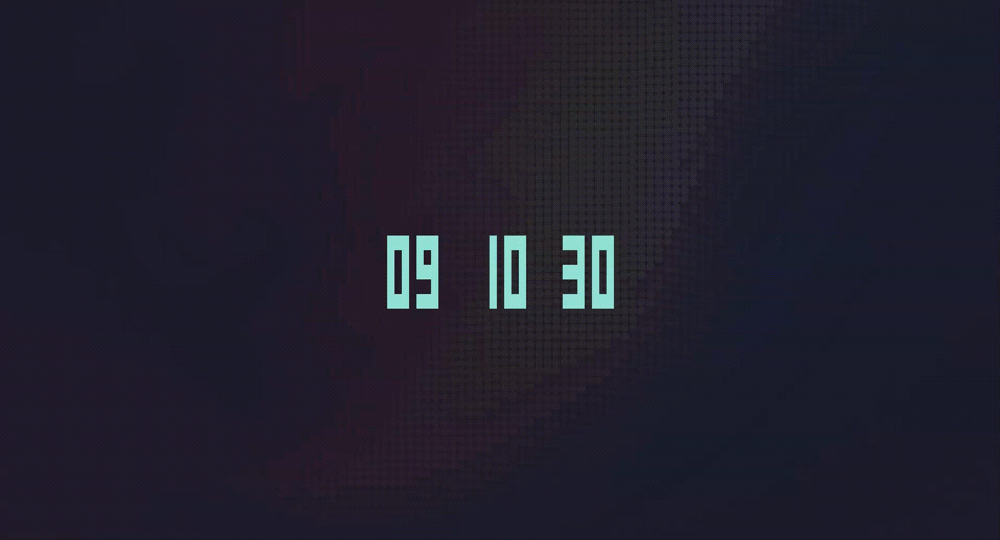
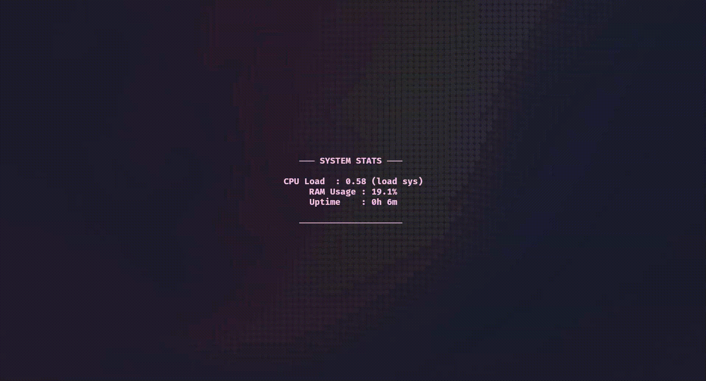
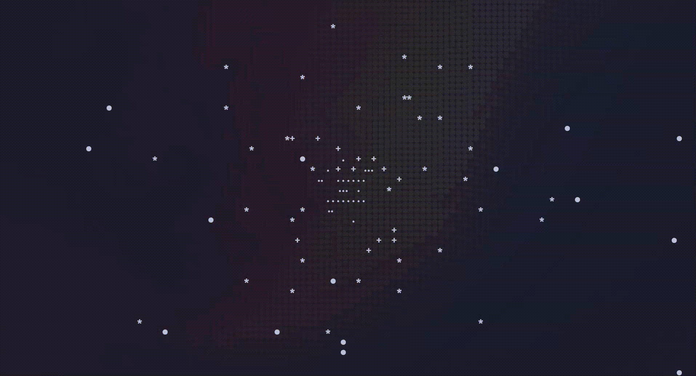
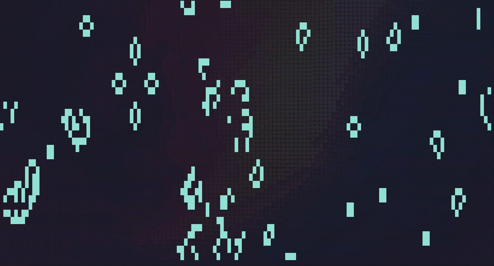

# Zidle

A multi-scene, Zsh-native terminal screensaver that triggers after a period of shell inactivity. It exits completely invisibly and cleanly restores your shell context (down to any in-progress typing buffers) upon any keypress.

---

## Features

*   **Zsh Native**: Leverages `TMOUT` directly down inside Zsh. Only starts when you haven't typed natively into your shell interpreter. Doesn't interrupt active processes like vim or tail.
*   **Modular Scenes**: Cycle natively over built-in Python logic loops. Readily expand functionality.
*   **Zero Glitches**: Returns control via curses `wrapper` alternative context mappings. No scrolling overlaps.
*   **Zero Dependencies**: Relies explicitly over the standard `sys/os` Python headers + `curses`. No need for generic system `pip` pollution.
*   **Cross-platform**: Written to resolve nicely on Linux and macOS natively.

## Built-in Scenes

It comes natively embedded to bounce rapidly on:

1.  **Matrix Rain** `matrix`
2.  **Digital Block Clock** `clock`
3.  **System Stats** `stats`
4.  **3D Starfield Warp** `starfield`
5.  **Bouncing DVD Logo** `bouncing`
6.  **Conway's Game of Life** `life`

*(You can configure if these should process systematically or randomly entirely under your user ~/.config variables).*

### Scene Previews

| Scene | Preview |
|-------|---------|
| **Matrix Rain** |  |
| **Digital Block Clock** |  |
| **System Stats** |  |
| **3D Starfield Warp** |  |
| **Bouncing DVD Logo** |  |
| **Conway's Game of Life** |  |

## Installation

1. Get the local repository:
   ```bash
   git clone https://github.com/mariostabile1/zidle.git
   cd zidle
   ```

2. Generate variables with our installer:
   ```bash
   chmod +x install.sh
   ./install.sh
   ```

3. Source it initially (or restart the terminal session context):
   ```bash
   source ~/.zshrc
   ```

### Alternative: Using Zinit Plugin Manager

If you use [Zinit](https://github.com/zdharma-continuum/zinit), you can easily install and configure Zidle directly without manually cloning or running `install.sh`. Add this snippet to your `~/.zshrc`:

```zsh
zinit light mariostabile1/zidle
```

*(Zidle will automatically create its default configuration in `~/.config/zidle` the very first time it starts!)*

### Alternative: Arch Linux (AUR)

If you are on Arch Linux or Arch-based distros, you can natively install `zidle-git` package using your favorite AUR helper:

```bash
paru -S zidle-git
```

or

```bash
yay -S zidle-git
```

## Configuration

The installer places your configuration at `~/.config/zidle/config.json`. 

```json
{
  "timeout": 60,
  "scenes": [
    "matrix",
    "clock",
    "stats",
    "starfield",
    "bouncing",
    "life"
  ],
  "theme": "default",
  "random_scene": true
}
```

*   **timeout**: Idle time in seconds prior triggering validation
*   **scenes**: Array list validating logic block rendering scenes explicitly. Only strings available map to execution.
*   **random_scene**: If statically false it will just pull the priority element (position 1 element).

## Manual Override Checks

You can push it forward manually when wanting to override normal wait contexts:

```bash
zidle start
zidle stop
zidle reload 
```

## Customizing

Zidle is designed to be easily modified. Out of the box, it supports modifying timeouts and enabled scenes.

If you want to edit how a scene looks (e.g., change the clock color), simply open `scenes/clock.py` and modify the `curses.color_pair(2)` argument.

## Adding a Custom Scene

Zidle safely supports loading your own personal scenes without modifying the repository source code (which is crucial if you installed via a plugin manager like Zinit, as internal folders are overwritten during updates).

To create a new scene, simply make a custom `scenes/` folder inside your configuration directory:
```bash
mkdir -p ~/.config/zidle/scenes
```

Then, drop a `<your-scene>.py` file into that folder following this template:

```python
class Scene:
    def __init__(self, stdscr):
        pass
        
    def setup(self):
        pass

    def get_delay(self):
        return 0.1

    def update(self, max_y, max_x):
        pass

    def render(self, stdscr, max_y, max_x):
        stdscr.erase()
        try:
            stdscr.addstr(max_y // 2, max_x // 2 - 5, "Hello World")
        except:
            pass
```

After creating your file, simply add your file name (without `.py`) to your `config.json`'s `scenes` list! Zidle will automatically merge and load scripts from both the core repository and your personal `~/.config/zidle/scenes` folder.

## Notes on Terminal Usage

* **Interactive Applications**: `TMOUT` in Zsh only triggers when sitting at the `PS1` command prompt. It **will not** trigger and interrupt you if you are inside `vim`, `nano`, `less`, `htop`, or while a long-running compile command is executing.
* **Safe Exits**: Exiting Zidle by pressing a key does not leak that keystroke into your shell. It simply redraws your prompt and any command you had partially typed out.

## Contributing

Every contribution is welcome! Please read the [Contributing Guidelines](CONTRIBUTING.md) for details on how to set up the project locally and submit Pull Requests. **Note: All Pull Requests must target the `dev` branch.**
